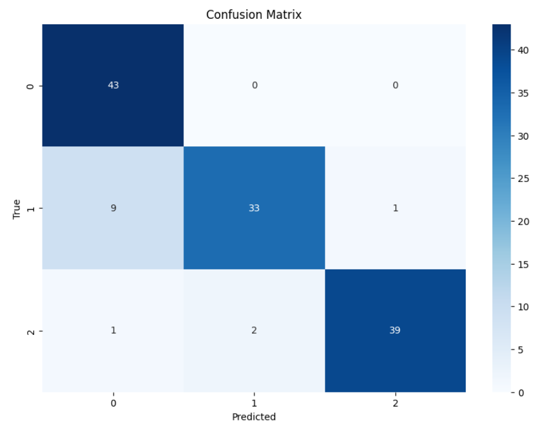

# Bean Leaf Disease Classification

This project aims to classify bean leaf diseases using deep learning techniques. The model is trained and fine-tuned using TensorFlow, Keras, and Keras Tuner for hyperparameter optimization.

## Process

### 1. Installation and Importing Libraries
Install the necessary libraries using pip and import them into the notebook. Key libraries include TensorFlow, Keras, Keras Tuner, Matplotlib, and others.

### 2. Setting Random Seeds
Set random seeds to ensure reproducibility of the results. This includes setting seeds for TensorFlow, NumPy, and the random module.

### 3. Loading and Visualizing Data
Load the "beans" dataset from TensorFlow Datasets.  
Display a few sample images from the dataset along with their labels to understand the data better.

### 4. Preprocessing Data
Define a scaling function to resize images and normalize pixel values.  
Create training, validation, and test datasets with batch processing.

### 5. Hyperparameter Tuning
Define a model architecture with a Keras layer from TensorFlow Hub for feature extraction.  
Use Keras Tuner to tune hyperparameters such as the number of units in dense layers, dropout rate, and learning rate.  
Perform hyperparameter search with early stopping to find the best hyperparameters.

### 6. Training the Final Model
Train the model using the best hyperparameters found during the tuning process.  
Plot training and validation accuracy and loss over epochs to visualize the model's performance during training.

### 7. Evaluating the Model
Test the model on some test samples and visualize predictions.  
Compute and display a confusion matrix and classification metrics like accuracy, precision, recall, and F1 score.

## Results

- **Accuracy:** 0.898
- **Precision:** 0.909
- **Recall:** 0.898
- **F1 Score:** 0.897
